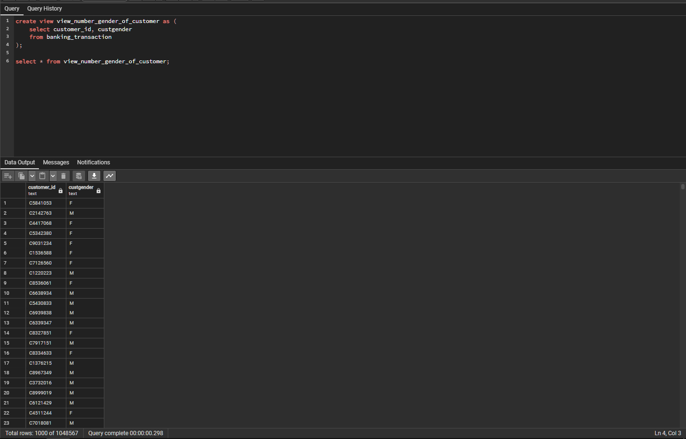
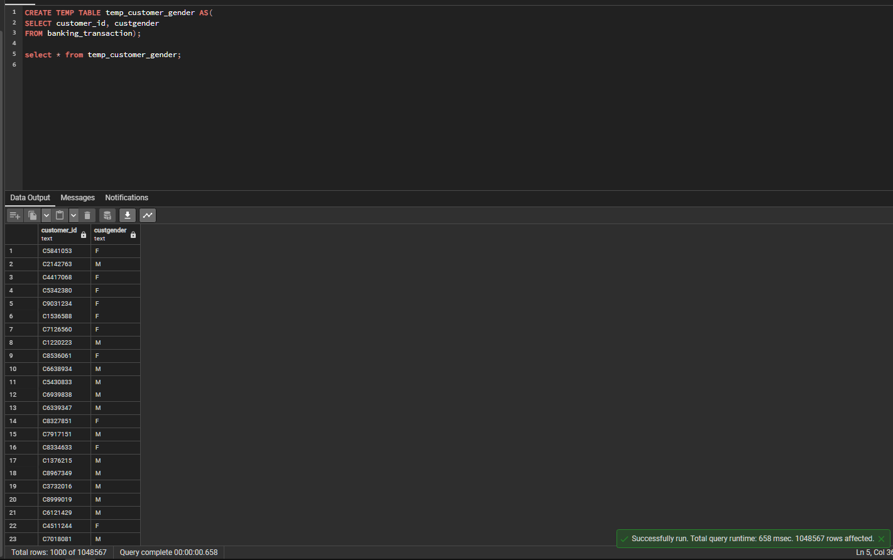
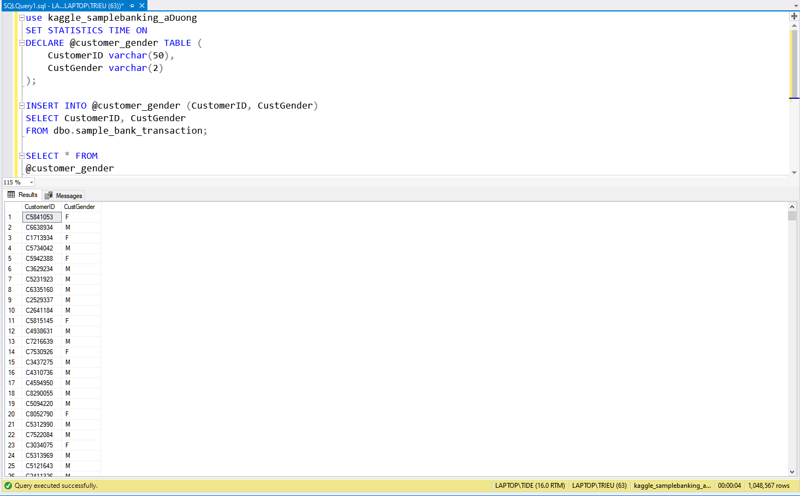

# Tìm hiểu kĩ để so sánh CTE, View, Temp Table, Table Variable, Inline TVFs

# TABLE OF CONTENTS
1. [CTE](#cte)
2. [View](#view)
3. [Temporary Table](#temp-table)
4. [Table Variable](#table-variable)
5. [Inline TVFs](#tvfs)
6. [Conclusion](#conclusion)

# Dataset Summary
- `Dataset` : Banking_Transactions

- `Number of columns` : 9
- `Number of rows` : 1.048.567

# <span id ="cte">CTE</span>
## Definition
- Stand for `Common Table Expression`. It's help us to make a temp name for query's result. That we can use in next query. By using `CTE`. We can divide a complex query into many simple query, easier in manage and maintain. And just can use `one time in one query`.

    

## Syntax
```sql
WITH CTE_NAME as (
	query
)

select column1, column2
from CTE_NAME
```
## Time
```sql
Planning Time: 0.042 ms
Execution Time: 132.953 ms
```

# <span id ="view">View</span>
## Definition
- View is a virtual table and created base on a query.
- It's not store the data
- Security and can reuse in many situation
- It exist in view table

    

## Syntax
```sql
create or replace view view_name as (
	select column1, column2
	from table
    where condition
);
select * from view_name;
```
## Time
```sql
Planning Time: 0.050 ms
Execution Time: 141.640 ms
```

# <span id ="temp-table">Temporary Table</span>
## Definition
- A temporary table exist in one session or transaction
- Will auto deleted after the session or transaction finished
- Use for store result during the session

    

## Syntax
```sql
CREATE TEMPORARY TABLE temp_table_name (
    column1 datatype,
    column2 datatype,
    ...

or

CREATE TEMP TABLE temp_table_name AS
SELECT column
FROM table
WHERE condition;
);
```
## Time
```sql
Planning Time: 0.064 ms
Execution Time: 90.409 ms
```

# <span id ="table-variable">Table Variable</span>
## Definition
- A variable in SQL Server only. Is stored a set of data into table
- Just exist during batch, stored procedure or function where it declare

    

## Syntax
```sql
DECLARE @table_variable_name TABLE (
    column1 datatype,
    column2 datatype,
    ...
);

INSERT INTO @table_variable_name (column1, column2)
SELECT column1, column2
FROM table
WHERE condition;
```

## Time

```sql
SQL Server parse and compile time: 
   CPU time = 0 ms, elapsed time = 1 ms.

 SQL Server Execution Times:
   CPU time = 1156 ms,  elapsed time = 1147 ms.

(1048567 rows affected)
SQL Server parse and compile time: 
   CPU time = 0 ms, elapsed time = 0 ms.

(1048567 rows affected)

 SQL Server Execution Times:
   CPU time = 265 ms,  elapsed time = 3247 ms.

 SQL Server Execution Times:
   CPU time = 0 ms,  elapsed time = 0 ms.

Completion time: 2024-07-09T10:40:59.8648766+07:00
```

# <span id ="tvfs">Inline TVFs</span>
## Definition
- A variable in SQL Server only. Is stored a set of data into table
- Just exist during batch, stored procedure or function where it declare

    

## Syntax
```sql
DECLARE @table_variable_name TABLE (
    column1 datatype,
    column2 datatype,
    ...
);

INSERT INTO @table_variable_name (column1, column2)
SELECT column1, column2
FROM table
WHERE condition;
```

## Time

```sql
SQL Server parse and compile time: 
   CPU time = 0 ms, elapsed time = 1 ms.

 SQL Server Execution Times:
   CPU time = 1156 ms,  elapsed time = 1147 ms.

(1048567 rows affected)
SQL Server parse and compile time: 
   CPU time = 0 ms, elapsed time = 0 ms.

(1048567 rows affected)

 SQL Server Execution Times:
   CPU time = 265 ms,  elapsed time = 3247 ms.

 SQL Server Execution Times:
   CPU time = 0 ms,  elapsed time = 0 ms.

Completion time: 2024-07-09T10:40:59.8648766+07:00
```


