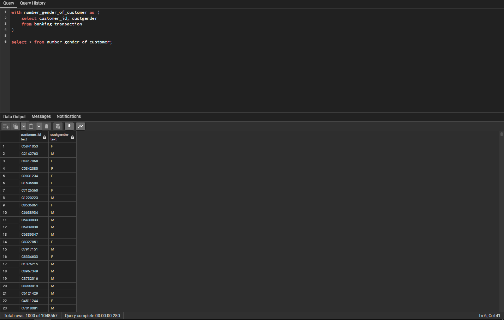

# Tìm hiểu kĩ để so sánh CTE, View, Temp Table, Table Variable, Inline TVFs

# TABLE OF CONTENTS
1. [CTE](#cte)
2. [View](#view)
3. [Temp Table](#temp-table)
4. [Table Variable](#table-variable)
5. [Inline TVFs](#tvfs)
6. [Conclusion](#conclusion)

# Dataset Summary
- `Dataset` : Banking_Transactions

- `Number of columns` : 9
- `Number of rows` : 1.048.567

# CTE
## Definition
- Stand for `Common Table Expression`. It's help us to make a temp name for query's result. That we can use in next query. By using `CTE`. We can divide a complex query into many simple query, easier in manage and maintain. And just can use `one time in one query`.

    

```sql
Planning Time: 0.042 ms
Execution Time: 132.953 ms
```


